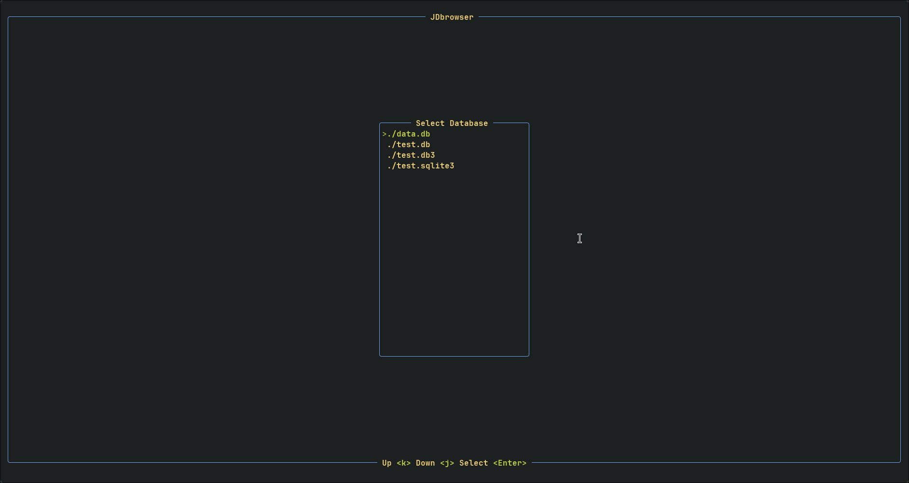
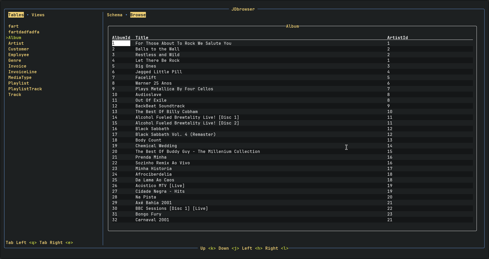
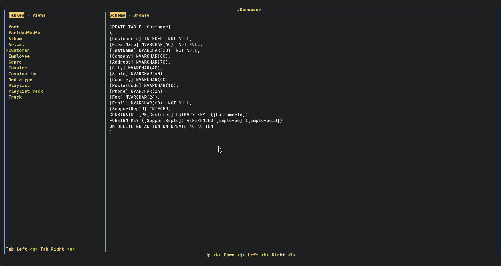

# JDbrowser - Sqlite Database Browser

Browse an Sqlite database from the terminal.

# Installation and Building

No configuration needed.

### Download Binary

Binaries are available for download [Here](https://github.com/Jkeyuk/JDbrowser/releases) 

### Install With Rust

A simple way to install the binary using Rust:

`cargo install --path .`

### Build with Rust

A binary can also be directly built with:

`cargo build --release` 

`cargo build --release --target x86_64-unknown-linux-musl` 

The binary will be available at ***target/release/jdbrowser***

# Usage

- Run the application from the directory containing the database.

- Select your database from the initial file menu.

- Use the keybindings to browse the tables and views of your database.

## Key Binds

### General

| Action | Keybind |
| -------------- | --------------- |
| Exit Application                        | Escape      |
| Help Menu Open/Close | ?| 

### File Menu

| Action | Keybind |
| ------------- | -------------- |
| Up        |  k        |
| Down      |  j        |
| Select    |  Enter    |

### Main view left side navigation

| Action | Keybind |
| ------------- | -------------- |
| Show Table/Views        |  q, e        |
| Up        |  shift + k        |
| Down      |  shift + j        |

### Table View

| Action | Keybind |
| ------------- | -------------- |
| View Data/Schema        |  shift + h, l        |
| Page Up / Down Half |  u, d |  
| Move Cell Up | k    |
|    Move Cell Down | j |
| Move Cell Left| h |
| Move Cell Right | l |

# Screen Shots

 

 

 

# TODO

- error handling popup
- handle blob data
- show preview window

- Add docs like peaclock
- add shell script to build or install
